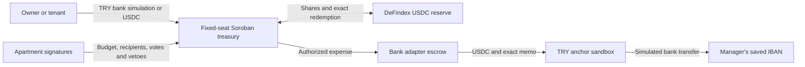

# Duly

Duly is a shared building treasury: residents pay dues, the manager announces an expense, and the approved amount reaches the manager’s saved IBAN under rules enforced by Stellar. Residents can follow the shared balance, approvals and bank receipts.

**[Try the live testnet demo](https://duly-sepia.vercel.app)** · [Contract evidence](duly/deployments/building-testnet-v3.json) · [Live payment evidence](duly/deployments/building-production-testnet-v3.json) · [Implementation notes](duly/docs/stories/02-building-governance.md) · [Dues accounting](duly/docs/stories/03-monthly-dues.md)

## Try it alone

1. Select **Tek kişilik demo / Solo demo**. Duly creates your own three-apartment test building. There is no role switching or manual account setup.
2. Open **Aidat öde / Pay dues**. **USDC ile katkı / Contribute USDC** is selected. In the solo demo, select **Test USDC yükle / Get test USDC** once, then contribute **5 test USDC** to an apartment. Funding your wallet does not pay dues. The **TL banka ödemesi / TRY bank payment** option remains available; try **200 simulated TRY**.
3. Inspect **Aylık borç takibi / Monthly dues tracking** on the same page. It shows each apartment’s paid, partial or unpaid status, remaining period debt and total arrears. Filter unpaid apartments or choose a previous period. Records are shared across browsers.
4. In **Giderler / Expenses**, enter a description and **100 TRY**. The saved manager IBAN is used automatically (the solo demo starts with a sample IBAN). The USDC spending ceiling updates with the TRY amount, using the current bank rate plus 10% headroom. Only the bank's actual quote is spent.
5. The demo’s **20-second objection window** replaces the normal three days. The registered payment proceeds automatically. The card distinguishes treasury disbursement from the bank’s final simulated receipt.
6. To explore governance, simulate another apartment’s objection or approval, propose a budget or manager, transfer a seat, or delegate its vote. Simulated votes are clearly labelled.

For a personal account, select **Passkey ile hesap oluştur / Create account with passkey**, enter a display name, then review it before confirming with your device. Returning users have a separate sign-in option. Your device’s passkey signs a real Stellar smart account. Duly sponsors testnet fees; no recovery phrase is entered into the app. Freighter, xBull and Albedo remain optional. Passkeys are bound to the site’s domain. Physical device signing, multi-device recovery and production wallet hardening require further validation.

**Yeni bina oluştur / Create a new building** sets up a treasury; **Mevcut binaya katıl / Join an existing building** opens a shared one using a QR scan, QR image or invitation link. A verified building preview shows its name before switching. Share its QR from the building page. Viewing a QR does not grant voting rights. The manager's validated payout IBAN is saved once per building and manager in this browser; another device needs the IBAN entered again. Changes apply only to new expenses.

## The building rules

| Action | Enforced rule |
| --- | --- |
| Apartment registry | 2–128 seats fixed at setup; no manager add/remove function. A person may own several apartments, but each seat counts once. |
| Sale | Current owner signs a direct seat transfer. Delegation is cleared and stale votes stop counting. |
| Missing owner | Manager proposes a buyer and document hash. A majority of the other apartments approve, then a 7-day objection window begins. The existing owner can veto. |
| Manager | Apartment majority elects and replaces the manager. |
| Routine spending | Majority-approved recipient plus remaining TRY **and USDC** budget allows payment without another vote or wait. |
| New recipient / budget exception | Explicit notice, then 3 days without objection; a majority may approve earlier. One objection requires a majority. Ordinary invoices cannot silently exceed the aggregate budget by splitting. |
| Budget period | Fixed 30-day periods from initialization. Changing the approved limit does not reset money already spent. |
| Dues periods | The setup-time dues amount accrues per apartment every 30 days from initialization. Payments clear oldest debt first; surplus carries forward. Debt follows the apartment when its owner changes. |
| Tenant | Anyone can pay for a seat. Payment grants no vote. The owner can appoint or revoke a voting delegate; a seat still counts once. |

Elapsed-time and ledger boundaries must both pass. The normal contract uses **3 days / 7 days / 30 days**. A separate demo WASM uses **20 seconds / 60 seconds / 10 minutes**. No administrator can shorten a deployed building’s timers.

The initial registry still depends on the founder entering real owners. A document hash does not prove legal title. The contract cannot prove who beneficially owns an IBAN. An over-budget proposal can pass without a veto, so the budget is **not an absolute loss cap** under this selected policy.

## Money and signatures



- **Stellar / Soroban:** native `require_auth`, persistent seats, versioned votes, events, immutable bank/token/vault configuration and permissionless execution of an already authorized expense.
- **Passkeys:** Smart Account Kit **0.8.0**, SDK **16.3.0**, pinned OpenZeppelin account WASM and WebAuthn verifier. Duly’s chain and bank code use SDK **17.1.0** through a serialized boundary. This integration is **not independently audited**.
- **Banking:** SEP-1, SEP-10, SEP-12, SEP-38 and SEP-6 against the workshop anchor. SEP-12 binds the bank recipient. The bank adapter uses an isolated classic escrow because the anchor watches classic payments with a memo. It is a trusted intermediary; bank settlement is not a trustless on-chain fact.
- **Recovery and automatic execution:** exact signed envelopes are saved before payment. The automatic expense journal is encrypted with AES-GCM in separate testnet account-data records, with sequence-based concurrent-write rejection. Public keeper responses expose neither the IBAN nor a decryptable bank-flow token. The fee sponsor reconciles each isolated request channel before retrying.
- **Scheduling:** registered payments advance while the app is open, with a daily Vercel keeper as fallback. This test deployment does not guarantee execution exactly at the deadline. Failed or expired bank orders remain visible for reconciliation; it does not silently send a replacement payment.
- **Dues accounting:** successful treasury contribution receipts are verified by a server adapter. TRY payments retain their paid TRY amount; direct USDC contributions retain a TRY value quoted before payment. Per-building Stellar account-data records survive browser changes, and an atomic receipt/reference claim prevents duplicate credit. The adapter is trusted for FX and accounting; the Soroban contract continues to enforce USDC contributions and governance, not TRY debt. Unmatched historical payments show **Review needed**, not an invented unpaid balance. [Details and limits](duly/docs/stories/03-monthly-dues.md).
- **DeFindex:** Circle testnet USDC enters the existing compatible liquid reserve; payment redeems only the shortfall. There is **no active yield strategy or APY claim**.

All funds are **testnet assets**. Bank transfers and FAST references are **simulated**. A real-money release needs a regulated bank/anchor partner, identity checks, operational fee funding, refund/reconciliation procedures, wallet recovery and independent security review.

## Run and verify

Node 24+ is required. Rust/Soroban builds use SDK 27.0.6 and `wasm32v1-none`.

```sh
cd duly
npm ci
npm --prefix web ci
# Creates your own private testnet bank key and an independent deployment.
node scripts/deploy-building.mjs
npm run web:build
npm --prefix web run serve
```

Open **http://localhost:5174** for passkey support. An IP address is not a valid WebAuthn relying-party domain. The local server serves only the built app and the API, never the source tree or key files. Do not copy another deployment’s bank key; the bank identity is fixed in each building.

```sh
cargo test --workspace
cargo test -p duly-building --features demo
cargo fmt --all -- --check
cargo clippy --workspace --all-targets --all-features -- -D warnings
npm test
npm --prefix web test
npm --prefix web run build
node scripts/verify-building.mjs building-production-testnet-v3.json
node scripts/verify-dues.mjs
npm --prefix web run test:browser
# These use real testnet transactions and keep private recovery state locally:
npm --prefix web run test:live
npm --prefix web run test:dues
DULY_URL=http://localhost:5174 npm --prefix web run test:passkey
npm --prefix web run test:queue
```

The browser tests cover both languages, both themes, mobile/desktop navigation and accessibility. The passkey test uses a **virtual CTAP2 authenticator** with real WebAuthn and real testnet signatures; it is not a claim that physical Touch ID/Face ID was tested. The queue test exercises bank settlement without an open browser, retry safety, encrypted storage and stale-writer rejection.

Public artifacts contain addresses and receipts only. `.duly-*-key`, `.duly-state.json`, browser storage and virtual-authenticator credentials are ignored by Git and excluded from deployment. Keep them to resume work.

## Repository

- [Building contract](duly/contracts/duly-building/src/lib.rs), [tests](duly/contracts/duly-building/src/test.rs), [immutable factory](duly/contracts/duly-factory/src/lib.rs)
- [Building interface](duly/web/src/BuildingApp.tsx), [chain workflows](duly/web/src/lib/building.ts), [passkey boundary](duly/web/accounts/index.mjs)
- [Dues ledger](duly/web/server/dues.mjs), [dues calculation](duly/web/src/lib/dues.ts), [manager table](duly/web/src/features/dues/DuesOverview.tsx)
- [Bank adapter](duly/web/server/bank.mjs), [encrypted journal](duly/web/server/journal.mjs), [keeper](duly/web/server/settle.mjs), [fee sponsor](duly/web/server/relay.mjs)
- [Vercel instructions](duly/docs/deployment.md), [continuation notes](duly/docs/agent-notes.md), [brand and image provenance](duly/docs/planning/frontend-design-package.md)

The earlier V2 treasury and test evidence remain in the repository; no V2 funds were migrated or drained for this release. The GitHub URL retains the historical `aidat` repository name; the product brand is **Duly**.
