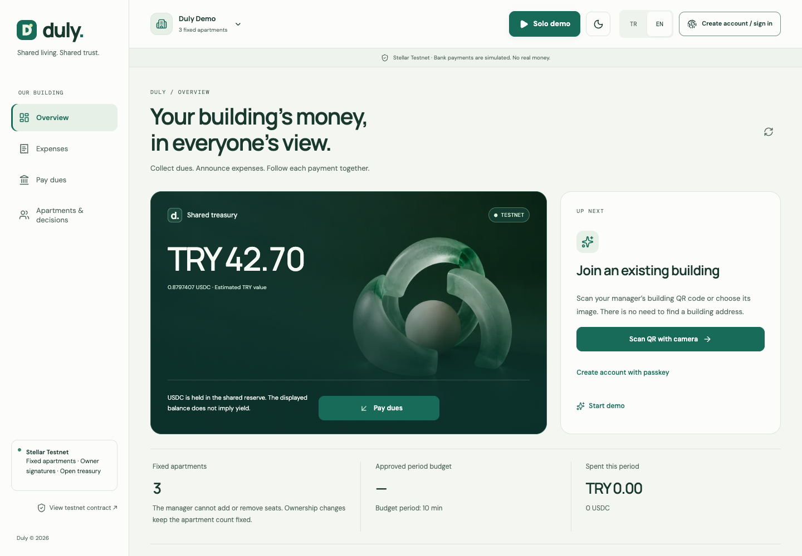
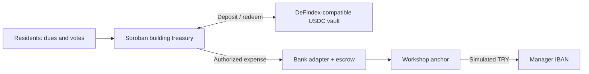

# Duly

**Duly helps apartment residents see where their dues go and control shared spending through a building treasury on Stellar.**

**[Live demo](https://duly-sepia.vercel.app)** · **[1-minute product tour · silent](https://duly-sepia.vercel.app/walkthrough.mp4)** · [Verified payment](duly/deployments/building-demo-ux-testnet-v3.json) · [3-minute pitch](duly/docs/pitch.md)

[](https://duly-sepia.vercel.app)

**Stellar Pro Hackathon 2026** · Built with **Soroban**, a **DeFindex-compatible USDC vault**, **Stellar anchor SEPs** and **passkey smart accounts**.

> **Working Testnet MVP.** On-chain transactions use real testnet contracts. TRY bank transfers and FAST receipts are simulated by the workshop anchor. No real money moves.

## The problem → the change

An elevator repair is paid from everyone's dues, but residents may only see a manager's spreadsheet or a message after the money is spent. They need a shared balance, clear approval rights and a payment trail.

Duly gives each apartment one vote. Residents can see dues and expenses, approve budgets and recipients, object to payments and replace the manager. The manager enters a TRY amount; Duly uses the saved manager IBAN and calculates the USDC ceiling automatically.

**The difference:** the shared record also enforces spending rules before funds leave the treasury. Stellar smart contracts, stablecoin settlement and passkeys make this workflow possible without requiring a wallet extension.

Our first intended users are volunteer managers and residents of small apartment buildings.

## Try it in two minutes

1. Open the demo and choose **EN → Solo demo**, beside the theme toggle. No passkey is needed; each of the three demo wallets starts with **20 test USDC**. See their balances in **My account**.
2. In **Pay dues**, contribute **5 test USDC**. Wallet funding alone does not pay dues. Existing demos can prepare their wallets with **Get test USDC**.
3. In **Expenses**, create a **100 TRY** expense. The labelled sample IBAN is prefilled; the automatic USDC ceiling includes 10% headroom.
4. Follow approval and settlement. The solo demo uses a **20-second** objection window. Bank confirmation can remain pending; the completed example below is available immediately.

The product tour shows the actual interface and an existing completed testnet expense; it does not claim a fresh bank transfer completes in one minute.

## Proof it works

A completed expense delivered **100 simulated TRY**, spending **2.0601077 test USDC** under a **2.27 USDC** ceiling. Simulated bank reference: `FAST-NVXJ9O5Y48`.

- **[Successful Stellar transaction ↗](https://stellar.expert/explorer/testnet/tx/8037e829426810484107dc51389a648f030c9f67c522e443ac54995a56a54bb0)** · [Machine-readable receipt](duly/deployments/building-demo-ux-testnet-v3.json).
- **[Building treasury ↗](https://stellar.expert/explorer/testnet/contract/CBIGWOYBTFHV32OZWTZSYKP2TLDPHJIDJJSG5XAGG22K6VRSSP2MLIMM):** `CBIGWOYBTFHV32OZWTZSYKP2TLDPHJIDJJSG5XAGG22K6VRSSP2MLIMM`.
- [Deployed factory, vault, token and verifier](duly/docs/evaluation-guide.md#deployed-contracts) · [Deposit → dues → payout evidence](duly/deployments/building-production-testnet-v3.json).

## How it works



| Technology | Why it is in the product |
| --- | --- |
| **Stellar / Soroban** | Enforces fixed apartment seats, signed votes, spending rules and one-time expense execution. |
| **DeFindex-compatible vault** | Holds the liquid USDC reserve; approved expenses redeem the needed amount. No active yield strategy or APY is claimed. |
| **Anchor SEPs 1, 10, 12, 38, 6** | Connect discovery, authentication, recipient data, FX quotes and simulated bank transfers. |
| **Smart Account Kit + OpenZeppelin** | Passkey signatures and sponsored testnet fees reduce onboarding steps. |

The adapter preserves payment references and separates treasury disbursement from bank confirmation. A delayed bank response remains pending. [Architecture, recovery and trust boundaries](duly/docs/evaluation-guide.md).

## Built during the hackathon / next

**Built:** fixed-seat governance, shared dues ledger, QR building access, passkey accounts, automatic expense limits, bank simulation and recoverable payment processing. A separate solo demo accelerates the contract timers.

**Next:** observe a real building pilot, establish a regulated TRY anchor partnership, and complete wallet recovery, refunds, reconciliation and independent security review before real funds.

**Limits:** the bank adapter is trusted for settlement and TRY accounting. Legal ownership requires off-chain verification. Paying the manager does not prove a supplier was paid. Normal new-recipient or budget-exception payments wait three days without objection, or receive majority approval earlier; one objection requires majority. Budgets are not absolute loss caps. No audit, mainnet readiness or paid adoption is claimed.

## Run locally

Node **24+**. The deployment step creates a separate local testnet bank identity; keep its generated keys private. Compiled contract artifacts are included.

```sh
git clone https://github.com/mryavascann/aidat.git && cd aidat/duly
npm ci && npm --prefix web ci
node scripts/deploy-building.mjs
npm run web:build
npm --prefix web run serve
```

Open **http://localhost:5174**. Testnet and workshop-anchor access are required.

```sh
npm --prefix web test                 # 51 web regression tests
npm --prefix web run test:browser     # TR/EN, desktop/mobile, light/dark
cargo test --workspace                # Rust contract tests
```

[Full setup, contract verification and integration tests](duly/docs/evaluation-guide.md#verification-commands) · [Deployment guide](duly/docs/deployment.md) · [Development skill references](duly/docs/evaluation-guide.md#stellar-references).

## Team & contact

[Project contributors](https://github.com/mryavascann/aidat/graphs/contributors) · [Contact the team](https://github.com/mryavascann/aidat/issues)
