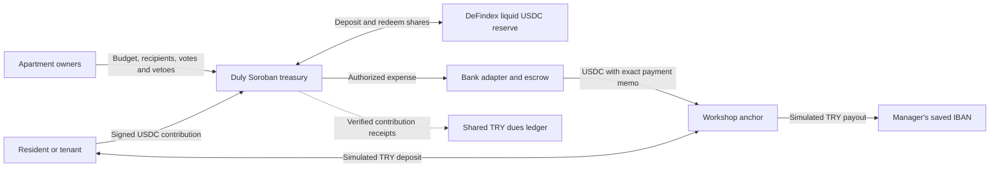

# Duly

### Shared building funds, with spending rules residents can verify

Apartment residents pay dues together, but often rely on one manager to explain where the money went. Duly gives the building a shared treasury: residents can see contributions, review expenses and enforce spending rules through Stellar smart contracts.

The manager enters an expense in Turkish lira. Duly calculates the USDC ceiling, applies the building's approval policy and routes the authorized payment to the manager's saved IBAN. Every apartment can follow the outcome.

**[Open the live demo](https://duly-sepia.vercel.app)** · **[Inspect a settled payment](duly/deployments/building-demo-ux-testnet-v3.json)** · **[View deployed contracts](duly/deployments/building-testnet-v3.json)** · [Three-minute pitch](duly/docs/pitch.md)

> Working MVP on **Stellar Testnet**. Stellar transactions are real testnet transactions. TRY bank transfers and FAST references are **simulated by the workshop anchor**. No real money is used.

## What works today

- **Collect and track dues.** Contribute test USDC or use the TRY bank simulation. See each apartment's paid, partial or unpaid balance in a shared dues ledger.
- **Control shared spending.** Each fixed apartment seat has one vote. Residents approve recipients and budgets, object to expenses and replace the manager by majority.
- **Pay a familiar bank account.** Enter a TRY amount and description. The manager's saved IBAN and automatic USDC ceiling remove repeated payment setup.
- **Join without crypto setup.** Preview a building through its QR code or invitation link. Use a passkey for a personal account, or explore the solo demo without a wallet extension.

Our first intended customer is the volunteer manager of a small apartment building. Residents and tenants use the same shared record. Professional management companies are a later customer segment.

## Try the complete flow

1. Open the demo, switch to **EN**, and choose **Solo demo**. It creates a separate building with three simulated apartments.
2. In **Pay dues**, choose **Get test USDC**, then contribute **5 test USDC** to an apartment. Wallet funding alone does not pay dues. Check the updated dues table.
3. In **Expenses**, create a **100 TRY** expense. A labelled demo IBAN is prefilled. The USDC ceiling uses the current bank rate plus 10% headroom; only the actual quote is spent.
4. Follow the approval state and final receipt. The solo demo uses a **20-second objection window** instead of the normal three days. Simulated votes are explicitly labelled.

Bank confirmation can remain pending at the external sandbox. Duly preserves that state and the original payment reference. For a quick evaluation, inspect the completed receipt below without waiting for a new bank order.

### A payment you can verify

| Recorded result | Evidence |
| --- | --- |
| Recipient amount | **100.00 simulated TRY** |
| Actual treasury spend | **2.0601077 test USDC**, below the **2.27 USDC** ceiling |
| Final bank status | **Settled**, simulated reference `FAST-NVXJ9O5Y48` |
| Stellar disbursement | [View transaction](https://stellar.expert/explorer/testnet/tx/8037e829426810484107dc51389a648f030c9f67c522e443ac54995a56a54bb0) |
| Reproducible records | [Payment receipt](duly/deployments/building-demo-ux-testnet-v3.json), [TRY deposit and payout round trip](duly/deployments/building-production-testnet-v3.json) |

## Why Stellar is part of the product



| Integration | Responsibility |
| --- | --- |
| **Soroban** | Holds the treasury and enforces fixed seats, signatures, spending permissions and one-time expense execution. |
| **DeFindex** | Receives contributions into a compatible liquid USDC vault. Approved payouts redeem the required shortfall. The integration sits in the money path. No active yield strategy or APY is claimed. |
| **Workshop anchor** | Uses SEP-1 discovery, SEP-10 authentication, SEP-12 recipient data, SEP-38 quotes and SEP-6 deposit/withdrawal flows. |
| **Passkey smart accounts** | Smart Account Kit and pinned OpenZeppelin contracts support WebAuthn signatures. Duly sponsors testnet fees. Stellar Wallets Kit provides optional external wallets. |

The bank adapter bridges Soroban payouts to the anchor's classic payment-and-memo interface. It saves signed transactions before submission and keeps an encrypted payment journal for recovery. Treasury disbursement and bank confirmation remain separate states, so a delayed bank response does not appear as a completed transfer. [Architecture and evaluation details](duly/docs/evaluation-guide.md).

## Rules and trust boundaries

Apartment seats are fixed at setup. An approved recipient within the remaining TRY **and** USDC budget can receive routine payments immediately. A new recipient or budget exception waits three days without objection, or receives majority approval earlier. One objection requires a majority. The budget is therefore **not an absolute loss cap** under this policy.

The contract enforces treasury rules. The bank adapter remains trusted for settlement, exchange rates and TRY dues accounting. Initial owner identity and legal property title require off-chain verification. Payment to the manager's IBAN does not prove a service provider subsequently received the money.

Normal buildings use 3-day objections, 7-day ownership recovery and 30-day periods. A separate demo contract accelerates these timers. The integration has not had an independent security audit. [Full governance rules](duly/docs/stories/02-building-governance.md) · [Dues accounting](duly/docs/stories/03-monthly-dues.md).

## Beyond the hackathon

Next steps are to validate the workflow with volunteer building managers, establish a regulated TRY anchor partnership, and complete security and wallet recovery work before handling real funds. A proposed subscription for management reports and multiple buildings needs pricing validation. User traction and paid adoption have not yet been established. SCF/InstAward preparation follows those milestones.

## Run locally

Use Node **24+**. The repository includes the deployed WASM artifacts. A fresh local deployment creates its own testnet bank identity and leaves the public deployment untouched.

```sh
git clone https://github.com/mryavascann/aidat.git
cd aidat/duly
npm ci
npm --prefix web ci
node scripts/deploy-building.mjs
npm run web:build
npm --prefix web run serve
```

Open **http://localhost:5174**. Keep the generated private key and recovery files locally. Never commit them. Contract builds require Rust, Soroban SDK 27.0.6 and `wasm32v1-none`.

```sh
cargo test --workspace
cargo test -p duly-building --features demo
npm test
npm --prefix web test
npm --prefix web run build
```

[Extended verification and contract IDs](duly/docs/evaluation-guide.md) · [Deployment guide](duly/docs/deployment.md) · [Contract source](duly/contracts/duly-building/src/lib.rs) · [Frontend](duly/web/src/BuildingApp.tsx)

Development workflow references and Stellar skill paths are documented in the [evaluation guide](duly/docs/evaluation-guide.md#stellar-references). The product is **Duly**; `aidat` remains the historical repository name.
