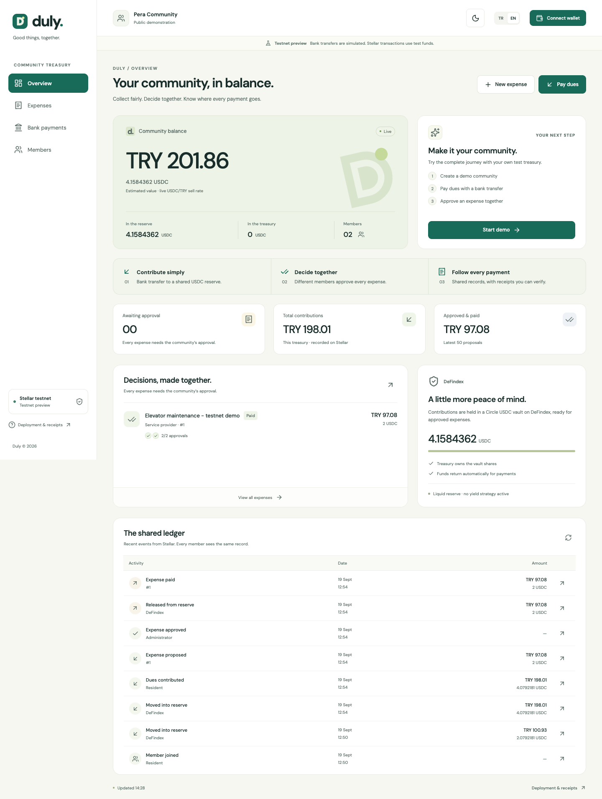
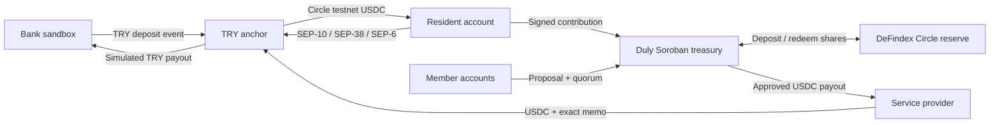

# Duly

A shared treasury for communities. Collect dues, approve expenses together, and follow every payment.

**MVP focus:** collect contributions → approve expenses together → follow the payment. Dark mode supports that same journey. Periodic billing, extra administration panels, additional currencies and yield products are deferred; this release does not add separate product modules.

[Treasury on Stellar](https://stellar.expert/explorer/testnet/contract/CC7TIRVPWB4EFE7ZPA3JZZD2VC5ZDRAHFN6UURSGW4JNJISMKGMGTKUR) · [DeFindex reserve](https://stellar.expert/explorer/testnet/contract/CBYR7JQC7XBG4TJIRVLZDTJZQE6UBGUZ7C5I4J64NPVNZ64YKBTLNUTG) · [Transaction evidence](duly/deployments/testnet.json)

**Working on testnet:** a Turkish/English web app, a Soroban treasury with member approval, Circle USDC held in a DeFindex vault, and a TRY anchor round trip. A ₺200 sandbox deposit delivered 4.0792181 USDC to the reserve. Two members approved a 2 USDC expense; the contract redeemed the required vault shares and paid the recipient, who withdrew for a simulated ₺97.08.

Bank settlement is simulated; Stellar transfers use real testnet transactions. The reserve is liquid, with **no active yield strategy**. No APY is claimed.

## Try it locally

With Node 24+ installed, from the repository root:

```sh
cd duly
npm ci
npm --prefix web ci
npm run web:build
npm run web:preview
```

Open **http://127.0.0.1:5173**. The public treasury is readable without a wallet. The interface starts in Turkish; select **EN** for English. Light/dark mode follows your device initially; the sun/moon control in the top bar saves your choice for future visits. The wallet chooser follows the selected theme too.

1. Select **Start demo**. Duly creates an independent treasury and three disposable testnet accounts in your browser. It never distributes the public treasury's administrator key.
2. As **Resident**, select **Pay dues**, get a ₺200 quote, then **Simulate bank transfer & pay dues**. The received USDC moves into the community reserve.
3. Select **New expense**. Describe the expense and propose 2 USDC to the prefilled service provider. The resident's first vote is recorded.
4. Switch to **Administrator** and **Approve**, then **Pay approved expense**. The treasury automatically redeems vault shares before paying.
5. Switch to **Service provider**, open **Bank payments**, and withdraw 2 USDC. The sandbox returns a bank receipt.
6. As administrator, **Members → Invite a member** creates a QR link with one use and a ledger-based expiry.

Test account keys and pending payment envelopes are kept in browser storage. Keep that storage to resume after a reload. These accounts are for testnet only. Each new browser demo has its own treasury, members and vault shares. Switching roles demonstrates separate signatures, not independent human participants.

External wallets connect through Stellar Wallets Kit (Freighter, xBull, Albedo). The chooser is browser-tested; signing with an installed external extension has not been exercised in this environment. The browser-generated account flow is verified end to end.



[Dark mode preview](duly/docs/screenshots/overview-dark.png) · [Mobile dark mode](duly/docs/screenshots/mobile-dark.png)

## Problem and solution

A community fund is difficult to inspect when its money and records sit with one manager. Duly holds the fund in a contract, publishes its balance and records members' decisions. A proposal fixes the recipient and amount; payment requires the configured quorum. The anchor supplies a TRY entry and exit for the demonstration.

The administrator still controls membership. Two signatures are required, but the administrator could enroll accounts they control. Membership governance and manager handover remain future work.

## How it works



- [Treasury](duly/contracts/duly-treasury/src/lib.rs): membership, invitations, contributions, proposals, approvals and fixed payouts.
- [Vault integration](duly/contracts/duly-treasury/src/vault.rs): asset validation, exact nested transfer authorization, share accounting and automatic redemption. The treasury owns the shares; redemptions return to it before payout.
- [Anchor client](duly/scripts/lib/anchor.mjs): the same browser-safe SEP client serves the web app and CLI.
- [Web chain client](duly/web/src/lib/chain.ts): public simulations, deployed-WASM verification, transaction confirmation and recovery. [Browser flows](duly/web/src/lib/flows.ts) orchestrate onboarding, bank payments and invitations.
- [CLI journal](duly/scripts/lib/state.mjs) and [browser storage](duly/web/src/lib/storage.ts): save signed envelopes before submission; a retry reconciles the same transaction. File locks/Web Locks prevent competing payment tabs or scripts.

## Stellar integrations

**Anchor.** SEP-1 discovers the workshop endpoints; SEP-10 validates the server signature, account, domains and network before signing. SEP-38 fixes a quote; SEP-6 tracks deposit/withdrawal settlement. A challenge is never submitted to Stellar. The sandbox needs no real KYC data. Its `/deposit` amount is TRY; `/withdraw` amount is USDC. The UI displays the actual bank reference, exact quote and expiry; withdrawals use the returned Stellar destination and memo.

**DeFindex.** The published reference USDC vault accepts a different asset from Circle testnet USDC. We created a compatible single-asset vault through the [official factory](https://stellar.expert/explorer/testnet/contract/CDSCWE4GLNBYYTES2OCYDFQA2LLY4RBIAX6ZI32VSUXD7GO6HRPO4A32), verified `get_assets`, and deployed the treasury with that immutable vault address. Contributions enter it automatically; approved expenses redeem only the shortfall. This integration is part of the actual payment path. There are no active strategies or vault fees, and the vault is not upgradable. An administrator test deposit funded DeFindex's initial 1,000 locked share units (0.0001 USDC), preserving the community's migrated balance.

**Soroban.** SDK 27.0.6; atomic constructor initialization; fixed quorum of at least two; `require_auth` for named members and administrator actions. `execute` can be relayed by anyone only after quorum. It cannot change the approved amount or recipient. There is no treasury upgrade method. The administrator's `invest`/`divest` methods move funds only between the treasury and its configured vault.

Instance storage contains configuration, members and the proposal counter. Persistent storage contains contributions, proposals and votes. Committed operations renew TTL; simulation reads do not. Temporary invitations and payout declarations check an explicit expiry ledger as well as host TTL. A payout declaration is not proof of bank settlement.

## Testnet deployment and proof

Verified September 19, 2026. Canonical treasury: [`CC7TIRVPWB4EFE7ZPA3JZZD2VC5ZDRAHFN6UURSGW4JNJISMKGMGTKUR`](https://stellar.expert/explorer/testnet/contract/CC7TIRVPWB4EFE7ZPA3JZZD2VC5ZDRAHFN6UURSGW4JNJISMKGMGTKUR).

DeFindex reserve: [`CBYR7JQC7XBG4TJIRVLZDTJZQE6UBGUZ7C5I4J64NPVNZ64YKBTLNUTG`](https://stellar.expert/explorer/testnet/contract/CBYR7JQC7XBG4TJIRVLZDTJZQE6UBGUZ7C5I4J64NPVNZ64YKBTLNUTG).

Circle USDC token: [`CBIELTK6YBZJU5UP2WWQEUCYKLPU6AUNZ2BQ4WWFEIE3USCIHMXQDAMA`](https://stellar.expert/explorer/testnet/contract/CBIELTK6YBZJU5UP2WWQEUCYKLPU6AUNZ2BQ4WWFEIE3USCIHMXQDAMA).

[Published WASM](duly/deployments/duly_treasury_v2.wasm), SHA-256 `ba49defc0fee7c77fa866999a6dce1a8784853726d613b41194e52e80ce7ec1f`.

- [Create Circle vault](https://stellar.expert/explorer/testnet/tx/58cd164bfed3297014148e2e929b47e2b88b4938df2eec08785020e0f18148ad) · [Deploy Duly treasury](https://stellar.expert/explorer/testnet/tx/3dbf9c99b612b1f7d1a3c35b0be2c60bca050df043274e1b52bb3d10e59c41ce)
- [Migrate previous balance with quorum](https://stellar.expert/explorer/testnet/tx/12c83eac9a01b3f64411ecc54b206f33ac397f0977a70c1bd3d3a64f201407d0) · [Invest the full 2.0792181 USDC](https://stellar.expert/explorer/testnet/tx/fc24c3f098154c5bd097d57dd0f4eb81b6dfc339ef3ecc70c1d42d2158078146)
- [Anchor deposit: 4.0792181 USDC](https://stellar.expert/explorer/testnet/tx/5e5abae04e2499e15d0bbee57400594d1be072e7daa529f92b280106ca268b54) · [Contribution and vault deposit](https://stellar.expert/explorer/testnet/tx/e6e70f84c7ca14a5cebaf2fedfa1102ffaf03f314327327333d11af3948e3c5d)
- [Propose expense](https://stellar.expert/explorer/testnet/tx/39dcef8f127a9f9eb2567c01d1b06aee7ff43b8b147be21b848f4bb16fdd3cee) · [Second approval](https://stellar.expert/explorer/testnet/tx/294b297c831c68dd4fca6bb482bf964ca867dfbf1b45f37ef0684fd25df15bd7)
- [Automatic redemption and 2 USDC payout](https://stellar.expert/explorer/testnet/tx/7988608557950395fcdbda2010590a7078f2c3f33c134e39c4e1ec66c0ea91f3)
- [Withdraw 2 USDC to anchor](https://stellar.expert/explorer/testnet/tx/3787ff7a67b884975a4e869e8f06cf7db8cf25266fa88442f0ed1ef35fc44820), sandbox bank receipt `FAST-82FQF7QZO6`, TRY 97.08.

The canonical treasury retained **4.1584362 USDC**, entirely in its vault shares, after that round trip. The previous treasury is empty; its original evidence and WASM are preserved in [the archive](duly/deployments/archive/aidat-testnet-v1.json). Historical file names and the existing GitHub repository URL remain unchanged for traceability.

The public verifier reads no secrets:

```sh
# From duly/
npm run verify
```

The independent browser demo has [public evidence](duly/deployments/browser-testnet.json) and a separate `npm run verify:browser` command, which verifies 13 receipts, three members, two approvals and vault backing.

The canonical verifier checks 21 successful transaction receipts, on-chain/published WASM equality, Circle asset identity, treasury-owned vault backing, the empty migrated treasury, approvals and exact anchor payment fields. It also checks the locally built WASM when present. A testnet reset can invalidate deployments or receipts.

## Development and verification

The verified toolchain is Node 26.7.0, Rust 1.98.1 and the `wasm32v1-none` target. Node 24+ is supported. Stellar CLI is not required by the scripts.

```sh
# From duly/
npm test
rustup target add wasm32v1-none
cargo test --locked -p duly-treasury
cargo fmt --all -- --check
cargo clippy --locked --all-targets -- -D warnings
npm run build:contract
npm run web:build
```

**30 contract tests, 12 script tests and 10 browser-domain tests pass.** Contract coverage includes signatures, quorum, replay, expiry and reserve redemption. Script coverage includes precision, SEP-10, persisted status and signed-envelope recovery. Browser-domain coverage includes quote boundaries, partial settlement, legacy payment history and account isolation.

With the preview running on port 5173 and Chrome installed:

```sh
cd web
npm test
npm run test:browser
npm run test:a11y
npm run test:theme
npm run test:recovery
npm run test:live
```

The live browser test creates disposable testnet accounts and performs real testnet mutations plus sandbox bank simulation. It exercises page-reload recovery, role-based approval, payout, withdrawal and a QR invitation. Test browser storage contains private test keys and is ignored under `web/test-results/`.

The accessibility suite checks four pages and two dialogs at desktop/mobile sizes in both themes (24 scenarios). The recovery suite adds 16 light/dark scenarios covering history, quote expiry, authenticated status checking, a settled deposit awaiting contribution and completed receipts. It uses a stub anchor and generated test keys and asserts no payment was submitted. These automated checks are not a complete accessibility certification, and the fixtures are not live payment evidence.

The theme suite verifies initialization before the app loads, device preference changes, a saved choice across reloads, keyboard controls, translations, 360px/768px layouts and the dark wallet chooser.

The redesigned journey also passed a new live round trip. Its [public proof](duly/deployments/browser-testnet-guided.json) preserves the original browser proof separately. From `duly/`, run `npm run verify:guided` to check the new treasury, 13 receipts, two approvals and exact bank payment. After a future live browser run, `npm run export:browser` exports only allowlisted public evidence to that file; run the verifier afterward.

## Design and development baseline

Duly follows the product → UX → architecture → story → verification sequence examined in [stellar-build](https://github.com/kaankacar/stellar-build/tree/40396f0946461b955091b15f0af9714d3a3ac8ae). The resulting implementation adds account-aware next actions, an explanation of the community journey, payment stages, scoped history and explicit bank-status recovery.

- [Product brief](duly/docs/planning/product-brief.md) and [requirements](duly/docs/planning/prd.md).
- [UX specification](duly/docs/planning/ux-design-specification.md) and [architecture decisions / reference analysis](duly/docs/planning/architecture.md).
- [Epics](duly/docs/planning/epics.md) and [implemented story](duly/docs/stories/01-guided-payments.md).

Project artifact paths are in `.stellar-build/bmm/config.yaml`. No global installer, agent hooks or ecosystem catalog are required by the app. The reference repository is pinned for traceability; its illustrative deployment commands do not replace the tested Duly toolchain.

For a separate CLI demonstration:

```sh
# From duly/, after building the contract
npm run setup
npm run deploy
npm run anchor:deposit
npm run demo
npm run payee:withdraw
npm run verify
```

New checkouts reuse the public, seeded Circle reserve unless `.duly-vault-id` selects another compatible vault. Existing keys are reused, never regenerated silently. Private `.duly-*-key` files are ignored and mode 600. The default payment commands resume their saved intent; `--fresh` explicitly starts another completed flow. Keep `.duly-state.json` to reconcile interrupted payments. The CLI contributes the dedicated member wallet's entire balance; the web contributes only the amount received from its bank order.

## MVP scope and delivery

The user fixed the MVP scope on September 19, 2026: one coherent contribution, shared-approval and payment-record journey. Remaining work is delivery and validation of this flow, not additional feature epics.

- Duly now has English and Turkish copy and a responsive interface. The GitHub URL still uses its original repository name. There is no public frontend deployment yet.
- The bank sandbox and liquid reserve are demonstrated; real fiat settlement, an active yield strategy, real-user traction and a production launch are not claimed.
- TRY values use the anchor's sell rate as an estimate. Final transfers use the quoted decimal amounts; display formatting never determines an on-chain payment.
- Browser keys are a testnet convenience. Production requires a different account/security model, membership governance, audits and a production anchor integration.
- Optional Wallets Kit dependencies still produce low/moderate npm advisories in unused cross-chain modules; no high/critical advisories remain in the current lockfile. Only Freighter, xBull and Albedo are loaded. Resolve upstream dependency findings before a production release.
- Remaining hackathon work: publish the frontend, confirm sandbox acceptance with mentors, prepare the official deck with actual team details, collect real attendee feedback and submit. These require external details/actions; no traction or team identities are invented.

## References used

- [`SKILL.md`, CheesecakeLabs/stellar-anchor-skill](https://github.com/CheesecakeLabs/stellar-anchor-skill/blob/main/SKILL.md), for discovery, SEP-10, SEP-6, SEP-38 and testing.
- [`skills/standards/SKILL.md`, stellar/stellar-dev-skill](https://github.com/stellar/stellar-dev-skill/blob/main/skills/standards/SKILL.md), for SEP and Soroban guidance.
- [`defindex-sdk-skill.md`, defindex-io/defindex-sdk](https://github.com/defindex-io/defindex-sdk/blob/main/defindex-sdk-skill.md) and [direct vault methods](https://docs.defindex.io/advanced-documentation/direct-contract-calls/vault-methods), for the live Circle vault integration. Direct contract calls require no DeFindex API key.
