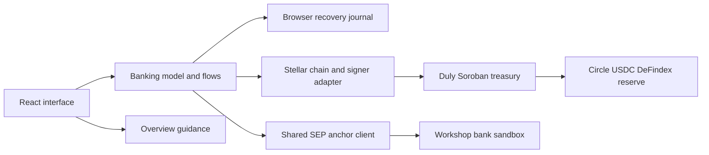

# Architecture decisions

## Reference repository inspected

Source: [kaankacar/stellar-build](https://github.com/kaankacar/stellar-build/tree/40396f0946461b955091b15f0af9714d3a3ac8ae), commit `40396f0946461b955091b15f0af9714d3a3ac8ae`, inspected September 19, 2026.

The inspected areas include its README/router, installer and project-config generation, third-party notices, product brief/PRD workflows, UX journeys/accessibility workflow, architecture consistency patterns, epic/story templates, development completion criteria, edge-case review, Soroban/security references, deployment workflow and learning-loop acceptance test.

The useful architectural contribution is an ordered development process: product intent → requirements → journeys → decisions → stories → evidence. It does not supply a community-treasury application, React component system or Duly-compatible contract. Accordingly the adaptation creates project artifacts and strengthens the existing application along those boundaries.

The installer also configures global agent skills, hooks, private traces and Raven MCP. Those are developer-tool integrations, outside the Duly runtime. They have not been installed or executed by this adaptation. `.stellar-build/bmm/config.yaml` only maps project artifact locations for compatible tools.

Its Stellar knowledge and SCF lifecycle content partly come from other upstream repositories at install time. Bundled ecosystem counts and idea catalogs are dated research inputs, not evidence of Duly's market fit. `NOTICES.md` describes the separate upstream licenses; no skill bundle or catalog is redistributed here.

Some bundled examples use `wasm32-unknown-unknown` and a separate initialization call. Duly keeps its verified `wasm32v1-none` build and atomic constructor. The target agrees with the current [official setup documentation](https://developers.stellar.org/docs/build/smart-contracts/getting-started/setup). Template examples do not override tested deployed behavior.

## Runtime boundaries

- **Presentation:** `web/src/features/banking/BankForm.tsx`, `PaymentHistory.tsx`, and `features/overview/` render facts and request actions. `App.tsx` owns navigation, wallet context and the existing expense/membership screens.
- **Payment model:** `features/banking/model.ts` owns phase derivation, history and legacy recovery compatibility. It has no network or signing dependency and is tested directly.
- **Orchestration:** `web/src/lib/flows.ts` coordinates membership, bank settlement and treasury contribution. It owns irreversible step ordering and publishes persisted progress to the UI.
- **Adapters:** `scripts/lib/anchor.mjs` supplies shared discovery, SEP-10, quotes and transfer status. `web/src/lib/chain.ts` handles simulation, signing, submission, confirmation and public-state verification. `wallet.ts` supplies the signer interface.
- **Enforcement:** Rust contract code controls member authorization, exact token movements, distinct approvals, immutable proposal terms, vault redemption and one-time execution.

No backend was introduced merely to match a workflow template. Existing locks, fixed-point amounts, deployment allowlists and public proof files remain the application's foundations. Further extraction of expenses and read-state hooks can follow concrete feature needs.

## ADR-01: Payment evidence determines progress

The domain uses `ready`, `processing`, `contribute`, `complete`, `expired` and `attention` for UI phases. Quote expiry uses an injected clock in tests. A saved attempt/receipt prevents elapsed time from being interpreted as an untouched order. Anchor settlement moves a deposit to contribution; only confirmed contribution finishes it. Withdrawal completion includes a bank receipt.

Status observations are persisted before polling returns or throws. This includes terminal/action-required statuses. A storage failure stops progression. The UI receives each saved update so a failed action cannot leave it displaying stale transfer instructions.

These rules use the [SEP-6 status definitions](https://github.com/stellar/stellar-protocol/blob/master/ecosystem/sep-0006.md#transaction-history), with a workshop-specific deposit/withdraw adapter already documented in the handoff. Unsupported bank statuses remain visible for reconciliation. Automatic replacement, cancellation and KYC flows are deliberately not inferred.

## ADR-02: Preserve every local payment intent

History is scoped by treasury and wallet. The old `duly:bank:<treasury>:<account>:<kind>` records are merged with `duly:bank-history:<treasury>:<account>` by order ID. New history is written before the old compatibility mirror; history wins if that mirror is stale. An unfinished order is preferred even when a later completed receipt exists.

The separate `duly:tx:<account>:<intent>` journal remains authoritative for signed envelopes. Bank UI records contain no authorization token. Web Locks serialize payment work across tabs. A fresh withdrawal checks the bank's current order state before signing; an already-processing order only permits reconciliation of a saved envelope.

Browser storage is not encrypted custody or durable account-wide history. Clearing it loses recovery context and disposable demo keys. The UI describes this limitation; public export continues to allowlist only proof data.

## ADR-03: Account context must not leak stale values

Changing the wallet/treasury clears its displayed balance and rate until reads finish. Failed wallet reads produce an unavailable state, rather than retaining another account's value. History is filtered by both identifiers and changes immediately with the selected role.

The next-action card uses current eligibility and recorded evidence. It does not infer monthly arrears from cumulative contributions. External wallets continue through the signer adapter; simulation/private-key demos stay testnet-specific.

## ADR-04: Keep the deployed financial contract stable

This design iteration does not change contract ABI, treasury addresses or WASM. The previous 30 contract tests and public deployment verifiers continue to describe the same enforcement. Testnet UI demonstrations may deploy independent treasuries; they do not migrate or spend the canonical treasury.

Production gates remain separate: identity/membership policy, custody recovery, anchor operations, audits, long-term indexing/TTL operations, governance and real-user validation. The reference repo's launch workflow is planning input, not evidence that these gates have been met.

## Verification and tradeoffs

Pure model tests cover expiry boundaries, unexpected statuses, partial completion, old records and account isolation. Shared-anchor tests verify that observers run before completion/failure and that storage failure stops progress. Browser recovery tests use generated disposable keys and a stub anchor with valid SEP-10 challenges; they assert that status checks submit no payment. The live browser suite verifies the separate actual testnet flow.

History remains local and unbounded for the hackathon scale. Snapshot reads and the initial SDK bundle remain performance work for larger communities. The live event window is bounded and cannot replace a durable indexer. Full cross-browser and installed-extension signing validation are still outstanding.
