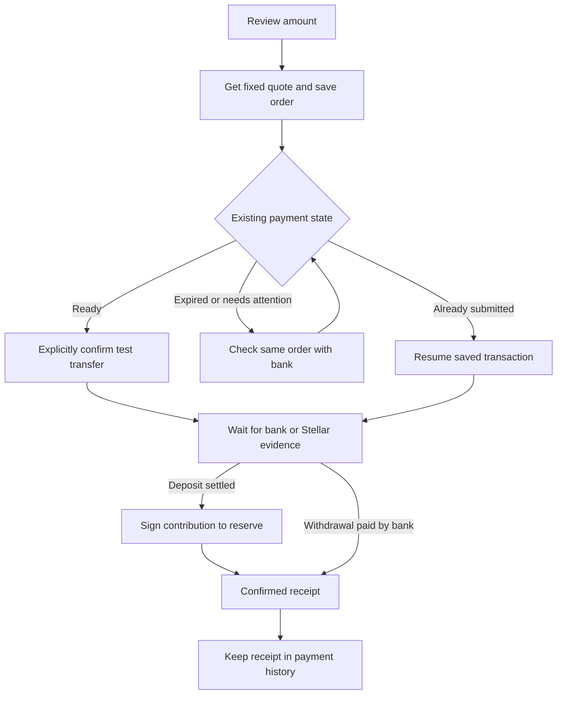

# Duly interaction design

## Product hierarchy

The first screen answers three questions: what the community holds, what this person can do next, and where past decisions can be checked. The existing warm paper, sage and deep teal palette remains the Duly identity; [brand.md](../brand.md) defines its tokens and voice.

Four persistent navigation destinations remain: Overview, Expenses, Bank payments and Members. The overview pairs the balance with one account-aware next-action card. Below it, three linked explanations introduce collection, approval and receipts. Statistics, decisions and event history follow.

## Next-action priority

1. A disconnected visitor can create or resume an independent demo.
2. Any connected account with an unfinished bank order sees recovery first.
3. An expense at quorum leads to the expense list for review and payment.
4. An eligible member with an uncast vote sees the approval prompt.
5. A member can contribute the configured suggested amount. This is not a claim about unpaid monthly dues.
6. A nonmember with at least the minimum withdrawal balance sees withdrawal.
7. Other nonmembers see how receipt of an approved payment works and can inspect their wallet.

Guidance never signs or submits a transaction on its own. Amounts and recipients remain reviewable in their actual action screens.

## Payment journey

The dialog has three visible stages. A deposit moves through fixed quote → bank transfer → community reserve. A withdrawal moves through fixed quote → USDC transfer → bank receipt. Stage advancement follows saved evidence, not a timer or a fabricated percentage.

An expired quote does not prove that a transfer failed. Processing orders retain their stage and reference; a settled deposit still offers the treasury-contribution step after the quote expires. Unknown or action-required statuses show an attention message and a status-check action. The raw order ID, last checked time and anchor status are available under a disclosure.

Checking the bank may require a wallet authentication signature. It does not submit a Stellar payment. Completed receipts expose a separate new-payment action. The service layer rechecks unfinished intents even if the user reaches that action from an older receipt.

## Payment history

The bank page contains deposit and withdrawal entry points, followed by saved payments and the community ledger. Each personal payment row includes direction, original amount/currency, creation time, textual status and a resume/view action. The heading explains that the list is scoped to this wallet, community and browser.

History is distinct from the chain's community-wide events. A provider can see their own bank withdrawal without making it look like a second treasury expense. Completed receipts remain available after another payment begins.

## Responsive and accessible behavior

At desktop widths, balance and next action form a two-column layout. The explainer has three columns and payment history uses compact aligned rows. At narrower widths these collapse into reading order; payment status and buttons wrap rather than overflow. Mobile navigation remains fixed with labels.

Dialogs use the native modal layer, restore focus and block dismissal while signing/processing. Every form has a label; statuses combine text and an icon. The skip link moves keyboard users to main content. Loading and failures use status/alert regions, and reduced motion is respected.

Verification uses Chrome at 360px and 1440px, both languages, automated contrast/semantic checks, and separate recovery fixtures. Manual VoiceOver, physical-device testing and installed-wallet signing remain additional validation work.

## Design inputs

This specification applies the journey, error-recovery, responsive and component-boundary themes inspected in stellar-build's [UX workflow](https://github.com/kaankacar/stellar-build/tree/40396f0946461b955091b15f0af9714d3a3ac8ae/skills/methodology/create-ux-design). The design decisions here are original to Duly and use the existing project and current user request as their inputs.
